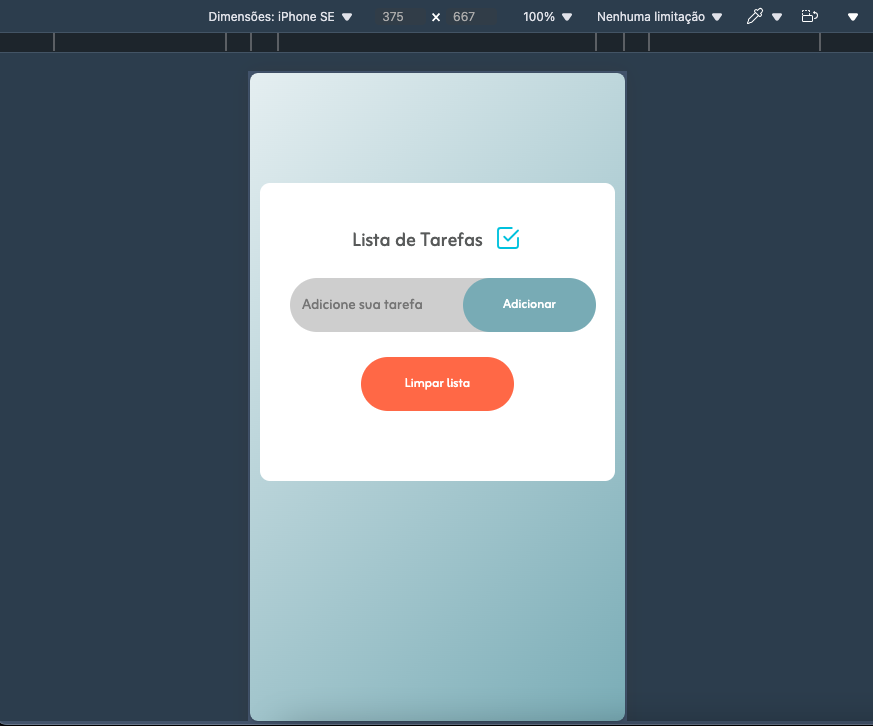
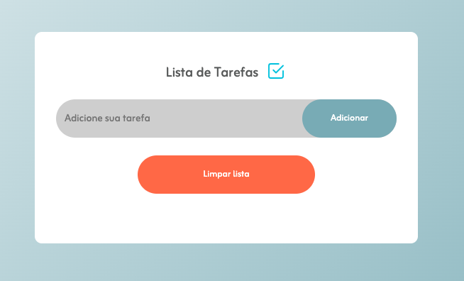
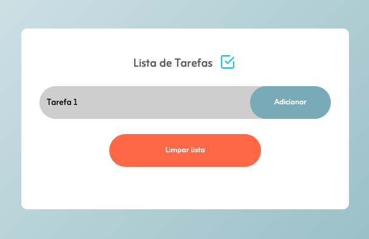
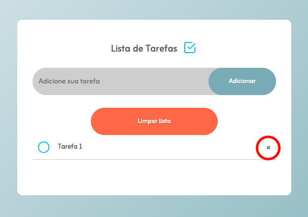
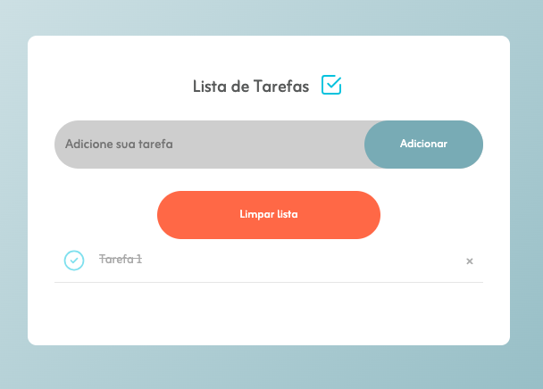
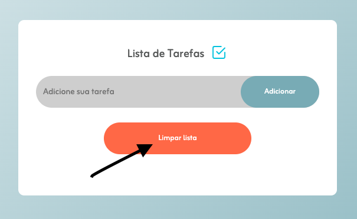

# Case 1
## To-Do List utilizando HTML, CSS  e JavaScript

Este projeto foi criado como requisito de participação do processo seletivo para o programa de estágio da Gama Ensino. 

Na proposta, foi solicitada a criação de um campo de entrada para uma nova tarefa, um botão que permitisse adicioná-la à lista e uma área de exibição da lista com seus itens. Essas funcionalidades deveriam ser implementadas com o uso de HTML. 

Com o CSS, seriam criados os estilos de aparência, como diferenciação de tarefas pendentes e concluídas, devendo explorar as classes das tags para reutilização de código. 

As funcionalidades deveriam ser escritas em JavaScript, com ações ao clicar no botão de adicionar ou pressionar a tecla "Enter", conclusão de tarefa (com diferente estilo visual), além da opção de remover uma tarefa com o botão "Remover".

## Funcionamento do código

O HTML foi utilizado para criação estrutural da página. 

Foram adicionados:
1. Campo de input, para que o usuário possa inserir a nova tarefa;
2. Botão de "Adicionar", para que a tarefa seja adicionada à lista; 
3. Área da lista, onde são exibidas as tarefas;
4. Botão de "Limpar lista", o qual exclui todas as tarefas adicionadas previamente.

A estilização da aplicação foi feita com o CSS. 

Optou-se por um design mais minimalista, com a intenção de manter o foco do usuário nas tarefas a serem realizadas.

Com o CSS foi possível:
1. Estilizar fundo da página;
2. Promover um visual mais agradável ao usuário;
3. Estilizar os botões de ação;
4. Promover diferenciação das tarefas pendentes e concluídas;
5. Personalizar o ícone que representa o checkbox da tarefa.

 Procurou-se tornar a aplicação responsiva, com a utilização de flex-box, para um visual que se adequasse a diferentes tamanhos de tela.

 
 Exemplo de responsividade em tela de iPhone SE

Por fim, o JavaScript trouxe as funcionalidades desejadas para a aplicação.

Foram criadas:

1. Função adicionarTarefa(): Essa função cria um novo elemento < li > dentro de uma < ul > no código HTML, utilizando como valor aquilo que foi inserido no input. Com ela também é acrescida uma tag (< span >), que recebe um ícone servindo como "botão" para remover  à tarefa. Caso não seja adicionado nenhum valor ao input, será exibido um alerta solicitando um valor.
2. Função verificaEnter(): Ao pressionar a tecla "Enter" no input, o evento é identificado e é executada a função adicionarTarefa();
3. EventListener "click": Ao identificar o click do mouse, o código realizará uma de duas funções -> se o item clicado possuir a tag < li >, será classificado como "marcado" ou "desmarcado", recebendo nova estilização; se o item clicado for < span >, a tarefa será removida da lista.
4. Função limparLista(): Ao ser chamada, essa função remove todas as tarefas listadas.
5. Função salvarDados(): Essa função salva no Local Storage os dados/tarefas presentes, fazendo com que os dados permaneçam na lista, mesmo que a página seja recarregada ou fechada. O mesmo se aplica para quando os itens são removidos.
6. Função mostrarDados(): Essa função exibe os dados salvos pela função anterior.

## Interação com a aplicação

1. Página inicial:

 

2. Adicionar tarefa:

 

A tarefa deve ser inserida no campo onde estava escrito "Adicione sua tarefa". Para adicioná-la, basta clicar no botão "Adicionar" ou apertar a tecla "Enter".

3. Tarefa adicionada:

 

A tarefa adicionada aparecerá na lista abaixo. Ela apresentará ícone de "check", ainda vazio, e o botão para remover, marcado em vermelho na imagem acima.

4. Concluir tarefa:

 

Ao clicar sobre a tarefa, a mesma será marcada como concluída, recebendo estilização diferente das demais e ícone de "check" marcado.

5. Limpar lista:

 

Para limpar a lista, deve-se clicar sobre o botão "Limpar lista", indicado com a seta preta na imagem.